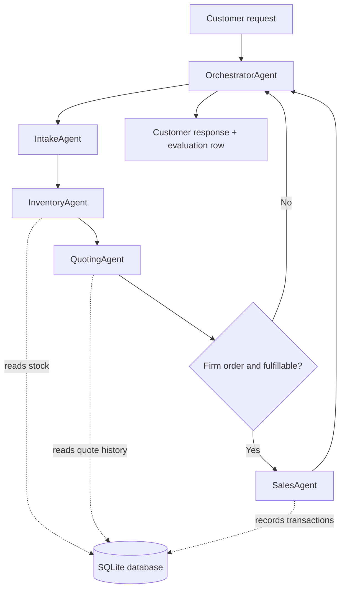

# Multi-Agent Paper Orchestration

Multi-agent paper sales orchestration system using pydantic-ai, SQLite-backed tools, structured outputs, deterministic validation, and reproducible evaluation.

This repository is the portfolio refactor target for the Udacity Agentic AI Nanodegree capstone project originally built for Beaver's Choice Paper Company. The passing submission is preserved under `legacy/`; the planned refactor will turn that single-file project into a small, readable Python package.

## Current State

- `legacy/project_starter_passing.py` preserves the passing capstone implementation.
- `data/` contains the customer request datasets used for historical quoting and evaluation.
- `examples/test_results_passing.csv` preserves the passing evaluation output.
- `docs/portfolio_refactor_plan.md` is the main plan.
- `docs/tasks/` contains the remaining standalone task briefs for piecemeal future work; completed briefs move to `docs/done/`.

The repo has been initialized this way so work can continue from another machine without needing the original chat context.

## Planned Architecture



## Quick Start

```powershell
python -m venv .venv
.\.venv\Scripts\Activate.ps1
python -m pip install -e ".[dev]"
copy .env.example .env
```

Edit `.env` and set `OPENAI_API_KEY`. The optional `OPENAI_MODEL` setting selects the pydantic-ai model; `BEAVERS_CHOICE_AGENT_MODEL` remains a backwards-compatible fallback.

The package skeleton and importable deterministic boundaries are in place. The files under `legacy/` remain the preserved behavior baseline while the remaining task briefs in `docs/tasks/` are completed.

## Passing Evaluation Baseline

The preserved passing run processed 20 customer requests:

| Metric | Result |
| --- | ---: |
| Fulfilled sales recorded | 5 |
| Quote-ready outcomes | 5 |
| Partial quotes needing review | 7 |
| Unfulfilled requests | 3 |
| Requests with cash-balance changes | 5 |
| Gross sales recorded | $1,413.50 |
| Restock spend recorded | $628.23 |
| Net cash change | $785.27 |

## Replay Spice

The original 100-request fixture remains the preserved baseline. For a fresh run, use the separate seeded workload at `data/quote_requests_spicy.csv`: it contains 32 reproducible requests spanning compact replenishment orders, enterprise-scale buys, specialty products, and rush deliveries, so the mix and aggregate outcome should differ substantially from the original evaluation.

Regenerate it with:

```bash
python scripts/generate_spicy_dataset.py
```

The generator uses seed `271828`; the alternate fixture is additive and never overwrites `data/quote_requests.csv`.

## Project Direction

The refactor should stay light: keep the working pydantic-ai agent design, remove Vocareum-specific configuration, split the monolithic file into modules, and add tests/documentation that make the system legible to hiring managers.

Key portfolio signals:

- multi-agent orchestrator-worker routing
- framework-executed pydantic-ai agents
- typed structured outputs
- tool use over SQLite-backed business functions
- deterministic validation around LLM outputs
- transparent customer responses
- reproducible evaluation and audit-friendly results

## Repository Map

```text
.
├── data/                         # Input datasets
├── docs/                         # Main plan, architecture notes, task briefs
├── examples/                     # Preserved passing outputs and future samples
├── legacy/                       # Passing single-file submission
├── scripts/                      # Future CLI wrappers
├── src/paper_orchestration/      # Refactored package target
└── tests/                        # Future deterministic and smoke tests
```
