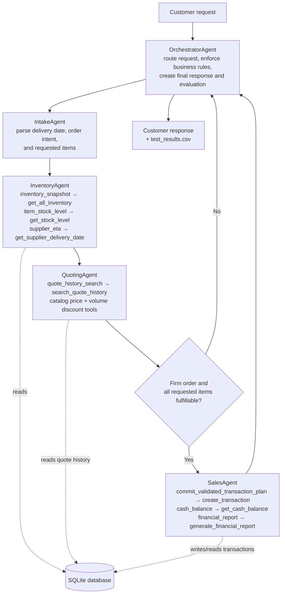

# Beaver's Choice Minimal Agent Workflow Diagram

```mermaid
flowchart TD
    A[Customer request] --> O[OrchestratorAgent<br/>route request, enforce business rules,<br/>create final response and evaluation]

    O --> I[IntakeAgent<br/>parse delivery date, order intent,<br/>and requested items]
    I --> V[InventoryAgent<br/>inventory_snapshot → get_all_inventory<br/>item_stock_level → get_stock_level<br/>supplier_eta → get_supplier_delivery_date]
    V --> Q[QuotingAgent<br/>quote_history_search → search_quote_history<br/>catalog price + volume discount tools]
    Q --> G{Firm order and<br/>all requested items fulfillable?}

    G -- Yes --> S[SalesAgent<br/>commit_validated_transaction_plan → create_transaction<br/>cash_balance → get_cash_balance<br/>financial_report → generate_financial_report]
    G -- No --> O
    S --> O

    O --> R[Customer response<br/>+ test_results.csv]

    V -. reads .-> DB[(SQLite database)]
    Q -. reads quote history .-> DB
    S -. writes/reads transactions .-> DB
```
